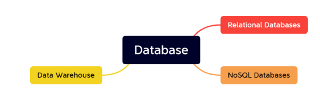
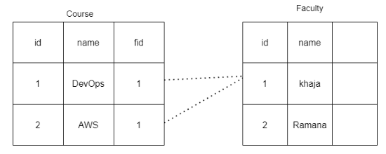
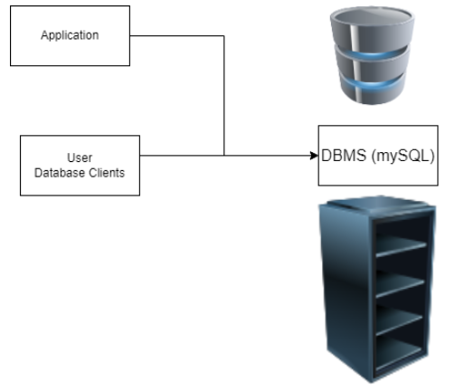
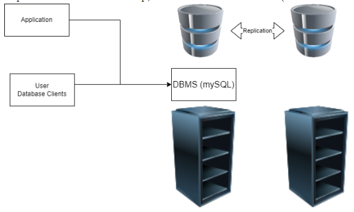
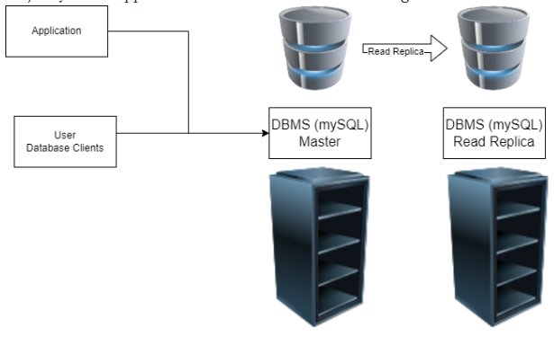
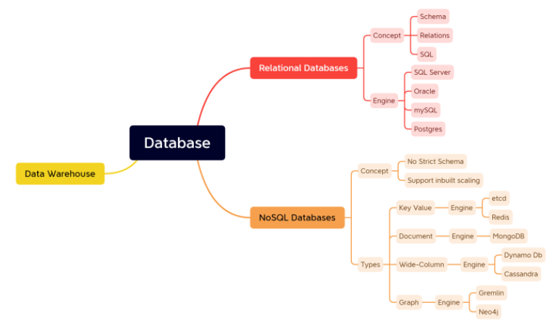

### Databases

* Database is collection of information
* Database Management Systems are softwares/engines which allow multiple users to parallely work with same data (Read/Write)
    * Read => Select
    * Write => Create/Update/insert
* Database types :
    * Relational Databases
    * NOSQL Databases
    * Data Warehouse

### Relational Databases

* Relational Database are databases, where we design the data in terms of `Tables with Rows and Columns`. The structure of the Table is called as _**Schema**_

* Each `row` represents a _**record**_
* Tables will have relationships between them
    * one – one
    * one – many
    * many – one
    * many – many

* To work with databases, a formal language called as _**SQL (Structure Query Language )**_ exists
* Popular Database Engines :
    * Microsoft SQL Server
    * Oracle
    * mySQL
    * mariaDB
    * PostgreSql
    * DB2

* Databases are used from `application code` as well as `db client software` to deal with data

* Scaling helps in solving the needs, as the usage grows
    * _**Vertical Scaling**_ : increase hardware or system resources
    * _**Horizontal Scaling**_ : increase number of servers running databases
* Relational Databases donot have inbuilt support for horizontal scaling
* Replications need to be setup, for `bidirectional transfers` (DBA skills are required)

* Majority of the applications read more data than writing

* Administration:
    * Installation/Patching/Configuring
        * OS
        * DBMS
    * User Managment
    * Connection Management
    * Backups and recovery
    * Performance Tuning
    * Replications

### NOSQL Databases

* _**NOSQL (Not only SQL)**_ Databases are used to store semi structured information
* NOSQL Databases are designed to support :
    * inbuilt horizontal scaling
    * semi-structured
    * don’t impose strict schema’s
* NOSQL Database Types :
    * Key-Value Stores
    * Document-DB
    * Wide-Column Databases
    * Graph Databases

### Goal: To Set up a database

#### On-premises

* To setup a Microsoft SQL Server on a Windows Server
* Download SQL Server and install it
* Once the installation is done, try installing Azure Data Studio to connect to the database.