### Databases

* Database is a collection of information
* Database Management Systems are softwares / engines which allow multiple users to parallely work with data ( Read / Write )
    * Read -> Select
    * Write -> Create / Update / Insert
* Database types :
    * Relational Databases
    * NOSQL Databases
    * Data Warehouse


### Relational Databases

* Relational Database, where we design the data in terms of `Tables with Rows and Columns`. The structure of the table is called as _**Schema**_
* Each `Row` represents a _**Record**_
* Tables will have `relations` between them
    * one – one
    * one – many
    * many – one
    * many – many


* To work with databases, a formal language called as _**SQL (Structure Query Language )**_ exists
* Popular Database Engines :
    * Microsoft SQL Server
    * Oracle
    * mySQL
    * mariaDB
    * PostgreSql
    * DB2

* Databases are used from `application code` as well as `db client software` to deal with data


* Scaling helps in solving the needs, as the usage grows
    * _**Vertical Scaling**_ : increase hardware or system resources ( increase the size practically )
    * _**Horizontal Scaling**_ : increase number of servers running databases ( increase the no.of machines to work on )
* Relational databases donot have inbuilt support for horizontal scaling
* Replications need to be setup ( with horizontzl scaling ), for `bidirectional transfers` ( DBA skills are required )


* Majority of the applications read data ( doesn't change the data ) more than writing ( Changes te data )


* Administration :
    * Installation / Patching / Configuring
        * OS
        * DBMS
    * User managment
    * Connection management
    * Backups and recovery
    * Performance tuning
    * Replications

### NOSQL Databases

* _**NOSQL (Not only SQL)**_ databases are used to store semi-structured information
* They are designed to support :
    * inbuilt horizontal scaling
    * semi-structured
    * don’t impose strict schema’s
* Types of NOSQL databases :
    * Key-Value stores
    * Document-DB
    * Wide-Column 
    * Graph 


### Goal : To set up a database

#### On-premises

* To setup a Microsoft SQL Server on a Windows Server, download SQL Server and install it
* Once the installation is done, try installing Azure Data Studio to connect to the database

### AWS with Managed Database

* Launch the RDS service and select options

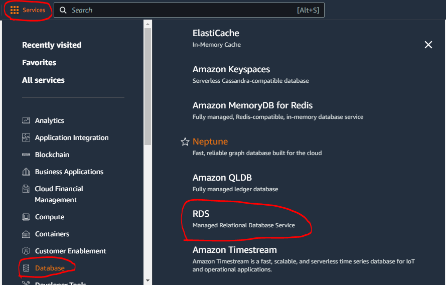

=> RDS => Databases => Create database => select some required options => Create database

* We got features like shown below already configured :
    * Vertical scaling
    * Replications
    * Backups

#### NOTE :

* Databases are generally servers which are connect from clients in three popular ways :
    * Command Line
    * GUI
    * Code (SDK)

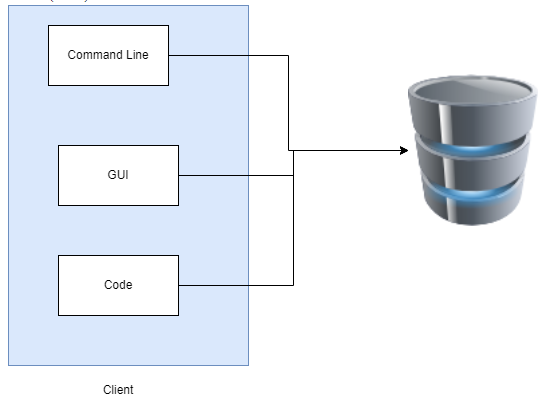

* _**Azure Data Studio**_ is a UI based Client which supports connecting to :
    * Microsoft SQL server
    * mysql
    * postgres

### Database Engines supported by AWS

#### Relational Databases
    
* Existing engines :
    * Oracle
    * Microsoft SQL Server
    * PostgreSQL
    * mySQL
    * maria db
* AWS managed engines :
    * PostgreSQL => RDS ( AWS Aurora for Postgres )
    * mysql => RDS ( AWS Aurora for mysql )
    * Oracle, MS-SQL, mysql, maria DB, postgres =>RDS

#### NOSQL 
    
* Engines :
    * AWS Dynamo DB
    * Neptune ( Graph database )
    * QLDB ( Ledger [ Block chain ] )
    * Timestream
* AWS managed engines :
    * Mongo DB => Document DB
    * Cassandra => KeySpaces
    * Redis => Amazon Memory DB for Redis
    * Redis, Memcached => Elastic Cache

#### What to expect from managed databases ?

* Features :
    * automatic backups
    * setting replications
    * Firewalls around databases
    * Disaster recovery

#### What not to expect from managed databases ?

* Older version support
* Shell access into os
* Performance tuning will not be managed ( you should still do this )

#### Terms

* _**Service**_ : What aws offers
    * Ownership : AWS
* _**Resource**_ : What we create
    * Ownership: you
* _**Cloud Services Provider (CSP)**_
* _**Cloud Services Consumer**_

### Services

* _**Relational Databases**_ : AWS RDS (Relational Database Service)
* _**NoSQL**_ :
    * Dynamo DB
    * Document DB
    * KeySpaces DB
    * Neptune
* _**Cache**_ :
    * Elastic Cache
    * Memory DB
* _**Block Chain**_ :
    * QLDB
* _**IOT**_ :
    * Timeseries DB
* _**DataWarehouse**_ :
    * Redshift

#### Using Database on AWS has three wider options

* Use Managed Databases
* Create your own ec2 instance and manually install / configure database
* Search for Market place ec2 AMI which helps in pre-installed databases

### Licensing

* AWS supports two kinds of Licensing
    * Software cost per hour
    * BYOL ( Bring your own license )

### RDS

*  _**Relational Database Services**_ offers fully managed databases for relational DBMS ( DataBase Management System )
* RDS supports :
    * mysql
    * mariadb
    * postgres
    * sql server
    * oracle

#### RDS Details

* Overview

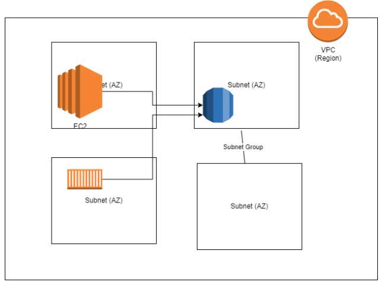

* AWS creates db instance in a subnet ( AZ ), of any network ( VPC )
* AWS expects us to provide more than one subnet while creating databases, this is referred as `DB Subnet Group`
* AWS VPC by default allows all traffic internally i.e. all private communication is allowed
* If your application and rds is in _**same vpc**_, all you need to know is _**names ( ip addresses )**_
* If your application and rds are in _**different networks**_, we need some _**extra configuration**_ at networking level :
    * VPC peering
    * VPN

#### RDS features

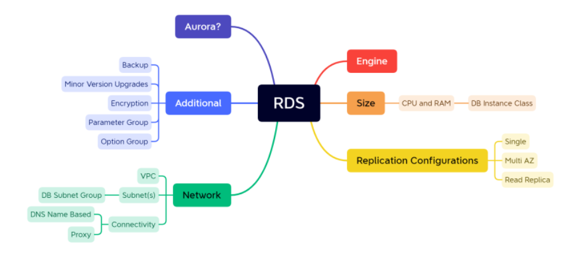

#### Create a RDS mysql instance ( free-tier )

* _**Free-tier details**_ :  includes 750hrs of Amazon `Relational Database Service ( RDS )` in a db.t2.micro, db.t3.micro, and db.t4g.micro Instances, 20GB of Storage and 20GB for Backups each month, for span of one year

* _**STEPS**_ :

=> RDS => Create database => Standard create 

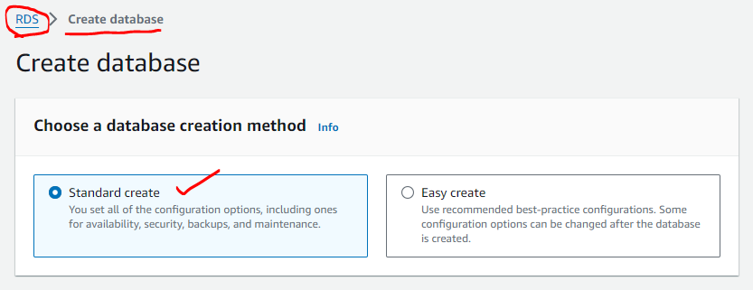

=>Engine options => Engine type : MySQL

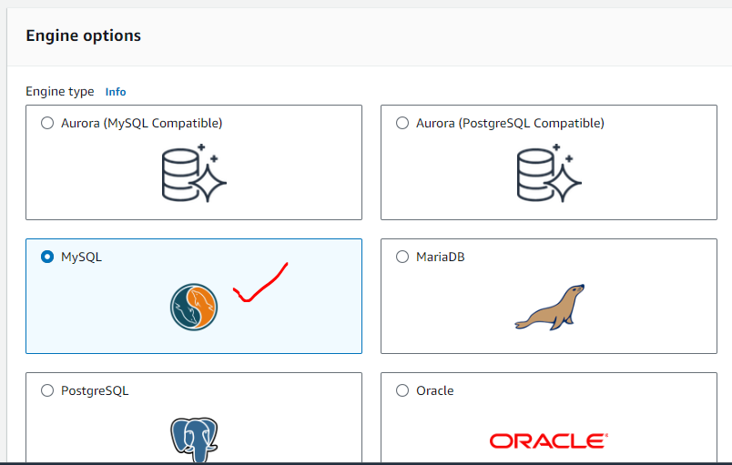

=> Engine Version : MySQL 8.0.35 => Templates : Free tier

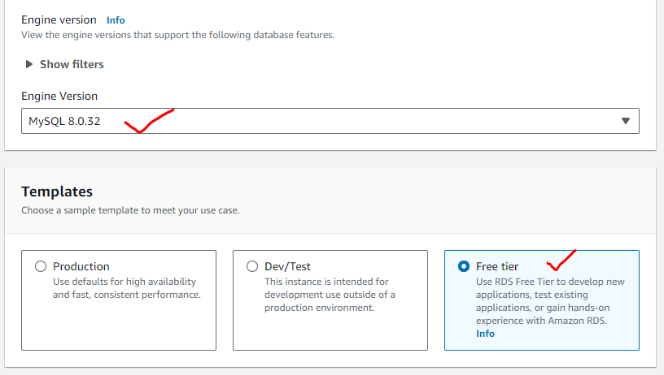

=> DB instance identifier : qtdemosrv => Credentials => Master username : qtdevops

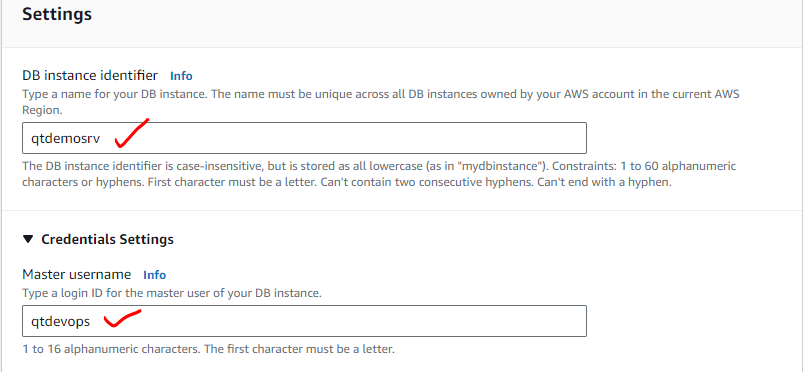

=> Master password : qtdevops => Confirm password 

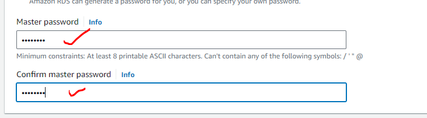

=> DB instance class : Burstable classes (includes t classes) => type : db.t3.micro

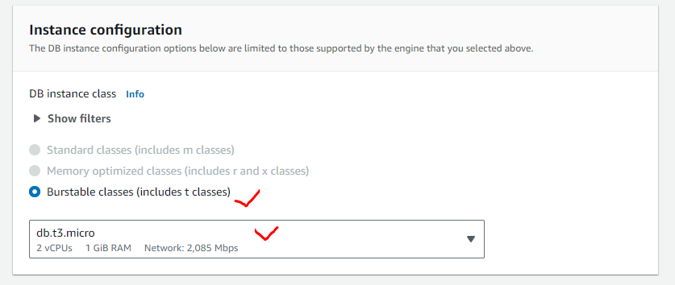

=> Storage type : General purpose SSD (gp2) => Allocated storage : 20

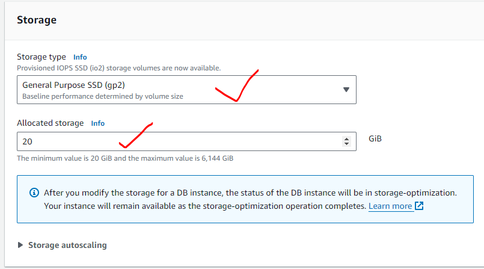

=> Connectivity => Compute resource : Don't connect to an EC2 compute resource => Network type : IPv4 => Virtual private cloud (VPC) : Default VPC 

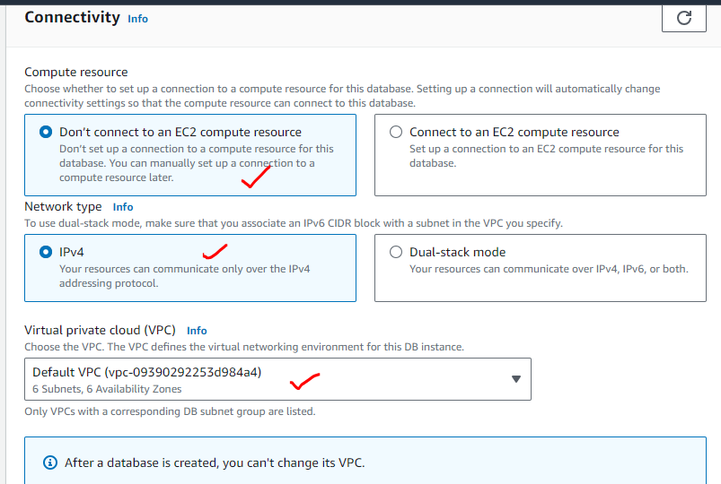

=> DB subnet group : default => Public access : No => VPC security group : Choose existing 

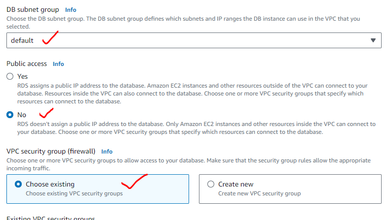

=> Existing VPC : default => Create database

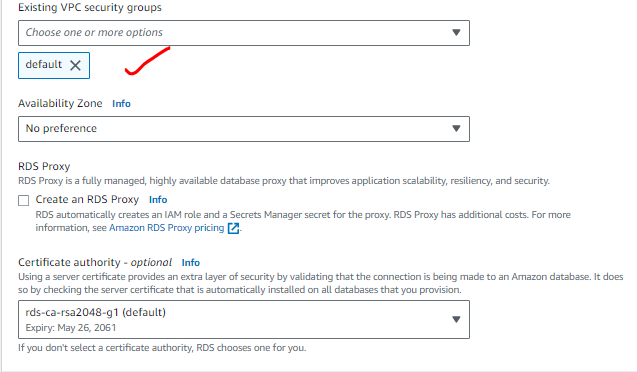
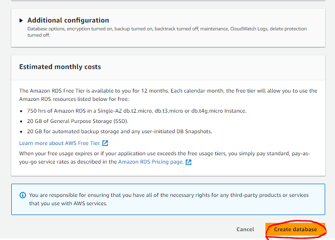
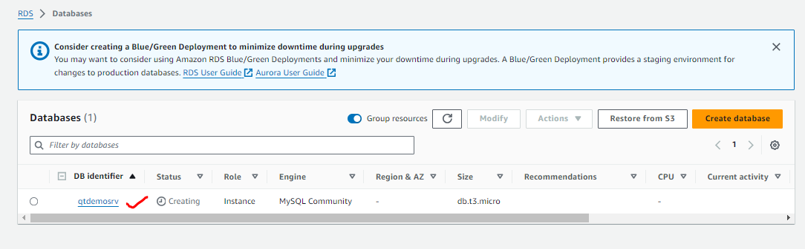

### AWS Interfaces

* We have three popular interfaces to work with AWS
    * _**Using Browser**_ : AWS Console 
    
    [ Refer Here : https://us-east-1.console.aws.amazon.com/console/home?region=us-east-1 ]

    * _**Using Commands**_ : AWS CLI
    * _**Using Code**_ :
        * Python Boto3
        * Other AWS SDK

#### Let's create a single mysql database managed by aws (RDS)

* _**Cost Aspects**_ : For pricing calculator

    [ Refer here : https://calculator.aws/#/ ]

    * Prices vary from region to region
    * _**Pricing Choices**_ :
        * _**On-demand**_ :
            * No-Commitments
        * _**Reservations**_ (might not be available for all services) :
            * We give commitment to AWS for 1 or 3 years
    * _**Charges**_ :
        * RDS
        * storage
        * backup
* _**Right Sizing**_ :
    * _**Instance classes**_ : For db instance type

        [Refer here : https://docs.aws.amazon.com/AmazonRDS/latest/UserGuide/Concepts.DBInstanceClass.html#Concepts.DBInstanceClass.Types ]

        * _**Memory Optimized**_ : High Memory to CPU Ratio
        * _**General Purpose**_ : Balanced CPU to Memory Ratio
        * _**Burstable**_
    * _**Storage**_ :
        * _**Types**_ :
            * General purpose
            * Provisioned
        * _**Size**_ :
            * Fixed
            * AutoScaled
    * _**Backup**_ : Size of backup directly propotional to costs

### Scenario :

* Your organization has a mysql database for dev environment which runs on Linux VM with  :
    * 2 vCPUs
    * 8 GB of RAM
    * 100 GB Harddisk (20 GB is used and 80 GB is free)
    * Size: db.t3.large
* Your organization has a postgres database which requires caching (requires decent memory) :
    * 8 vCPU
    * 32 GB
    * 100 GB (used: 80 GB)
    * _**Size**_ : `db.r5.xlarge` or `db.r5.2xlarge`
    * _**Storage**_ : min, _**Size**_ : 80 Autoscaling till 200 GB

### Single-AZ v/s Multi-AZ deployment in aws RDS

#### Single-AZ Deployment
    
* _**Overview**_ : RDS will be created in any one AZ in db subnet group

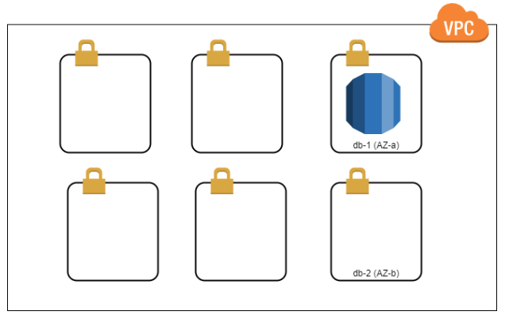

* _**No Failover**_ : If the database fails we have to rely on our backups to create a new database
* Recommended for dev/test environments
* To make it work for production, backup strategies have to be decent

#### Multi - AZ Deployment
    
* _**Overview**_ : 
    * RDS will create a `Main / Master` and `Standby` DB instance in two different AZ
    * Any changes in _**Main/Master**_ will be synced to _**Standby**_ ( i.e. a DB statement will be complete only when it is synced with _**Standby**_ )
    * Automatic Failover between `Master` and `Standby` is available
    * _**Main / Master**_ and _**Standby**_ will be of same size
    * RDS Endpoint is a DNS Name which points to _**Main / Master**_ and if failover happens it points to _**Standby**_

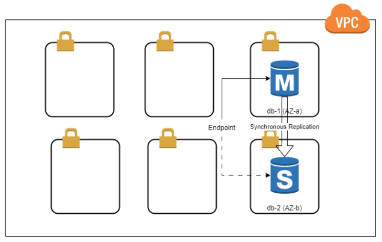
    
* Recommeded for running production instances
* _**Read Replicas**_ can be created in same region or cross region. Read Replicas help in unloading the _**Main / Master**_ db instance with read traffic


### Creating a Read Replica

* Create a free-tier mysql RDS instance `qtrdsnopcommerce`

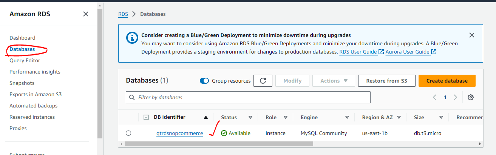

* Ensure backups are enabled

=> select the database created => Go to Maintenance and backups => Actions => Turn on backups => Apply immediately => Turn on backups

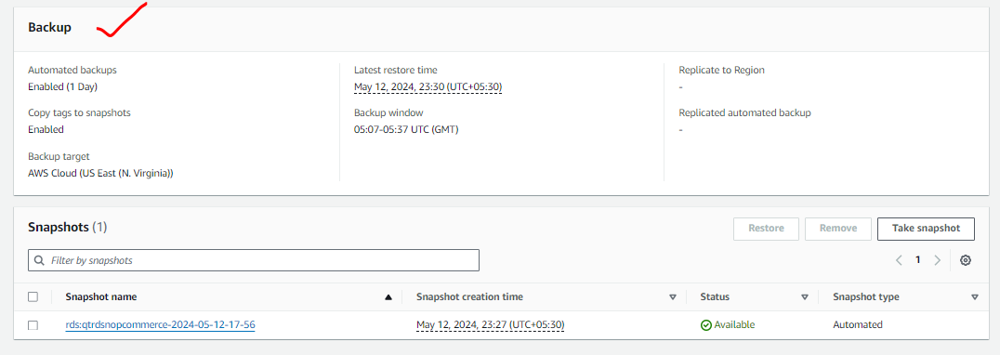

* Create read replica

=> select the database created => Actions => Create read replica

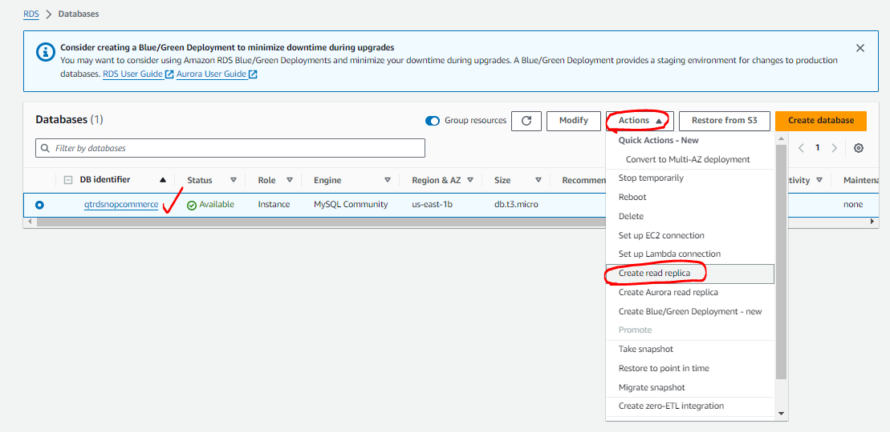

=> DB instance identifier : qtrdsreadnopcommerce

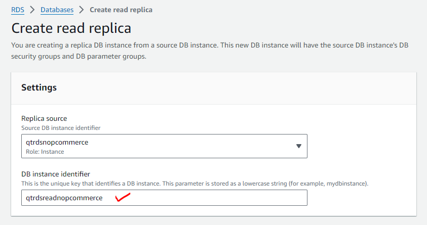

=> AWS Region : select the region of choice

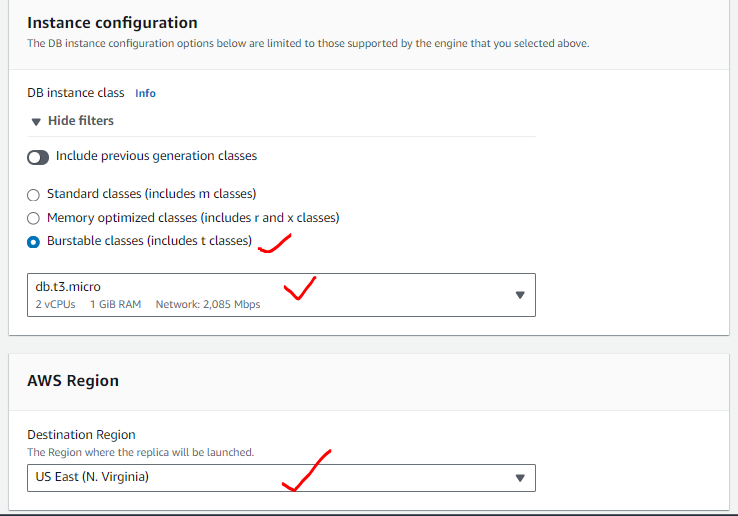

=> Storage => Storage type : General purpose SSD (gp2) => Allocated storage : 200 GB

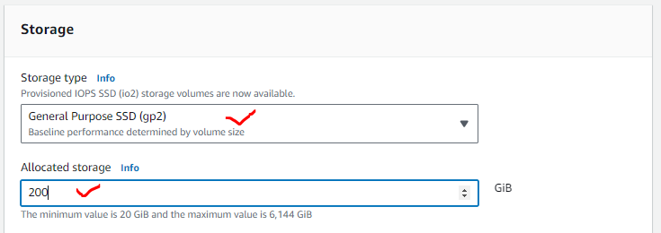

=> Availability : Single AZ => Maintenance 

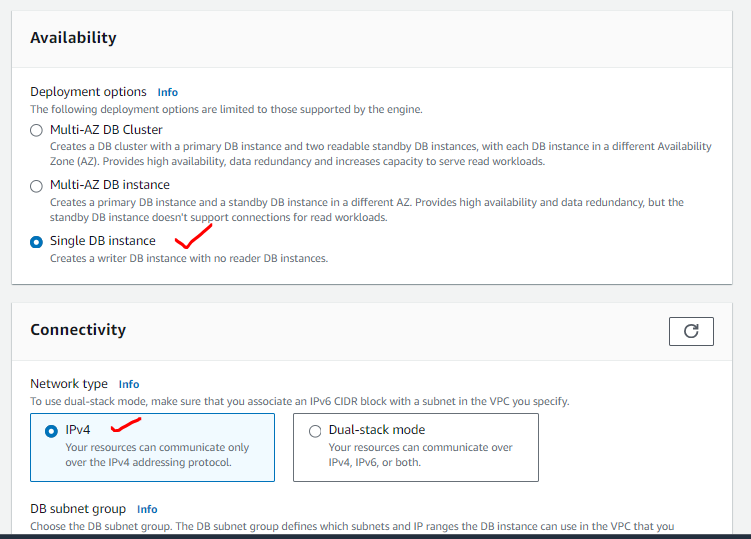
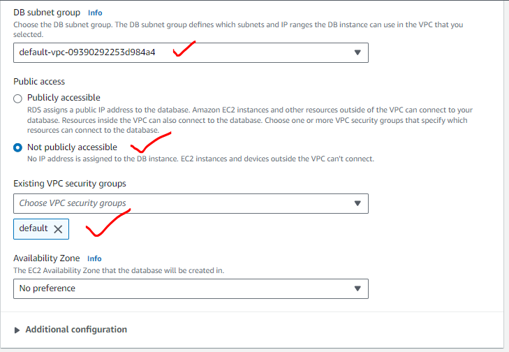
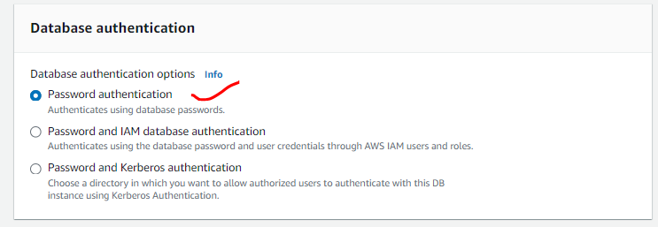

=> Enable auto minor version upgrade => Create read replica

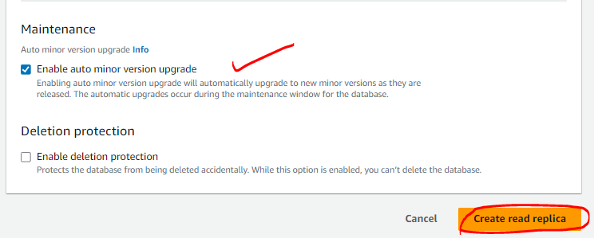
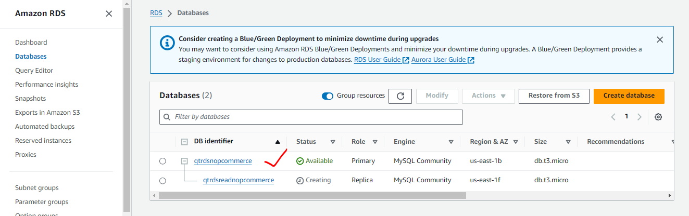

### Multi-Az Deployment

#### Scenario: 

* Let's create a multi az rds mysql db instance and then create a read replica in a different region
* With multi az, we get HA and auto failover. This is generally used in production
* The cross region read replica is to offload the read traffic for analytics / Business Intelligence applciations
* Create a multi AZ DB instance with mysql of size t2.micro or t3.micro, storage => gp2 (20GB), new security group

=> RDS => Create database => database creation method : Standard create => Engine type : MySQL => Engine version : select the latest => Templates : Free tier => Settings => DB instance identifier : qtrdsreaddemo => Master username : qtdevops => Master password : qtdevops => Confirm password => instance configuration => select Burstable classes => size : db.t3.micro => Storage => type : gp2 => Allocated storage : 20 GB => Unselect storage autoscaling => Public access : yes => vpc security group : select with openall => Backup => enable automated backups => 1 day => Create database 

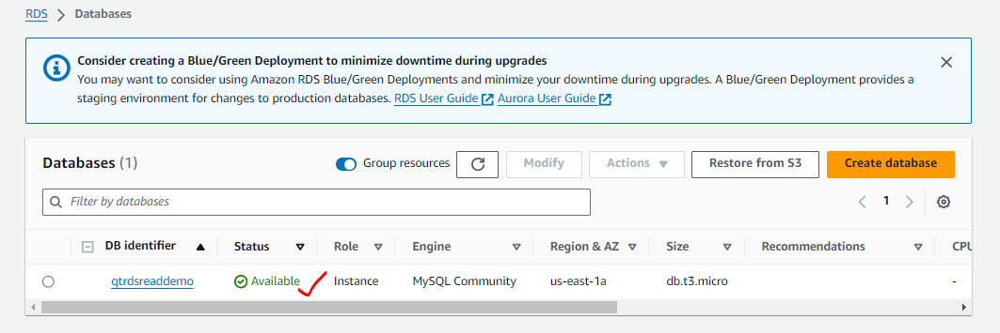

* Create a read replica in different region

=> select the database created => Actions => create read replica => DB instance identifier : qtrdsread => AWS region : select other region => Availability => select Multi-AZ DB instance => Create read replica

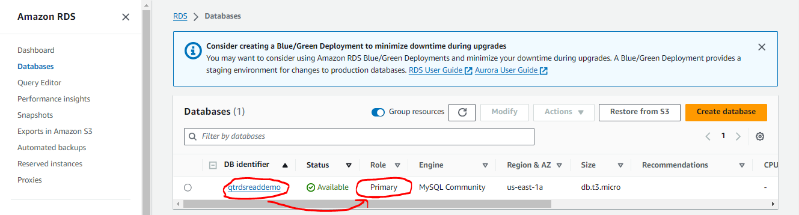
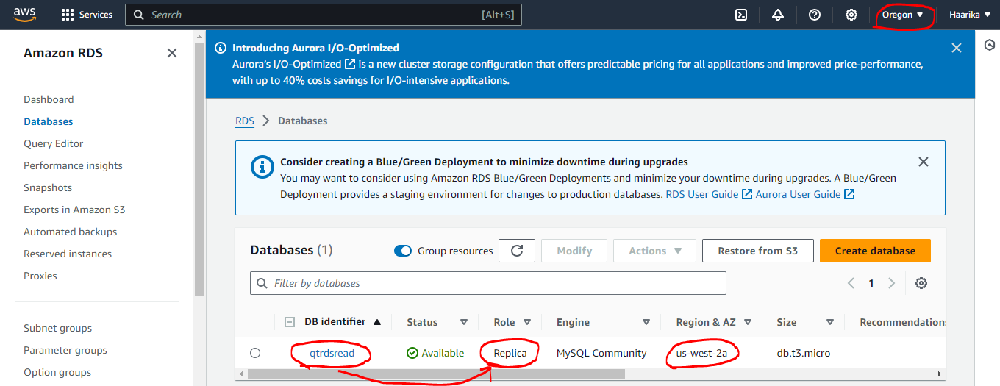

### Aurora Architecture

* Aurora for mysql gives five times improvement and Aurora for postgres gives three times imporovement in query performance
* _**Aurora Architecture**_ : 

    [ Refer Here : https://docs.aws.amazon.com/AmazonRDS/latest/AuroraUserGuide/Aurora.Overview.html ] 

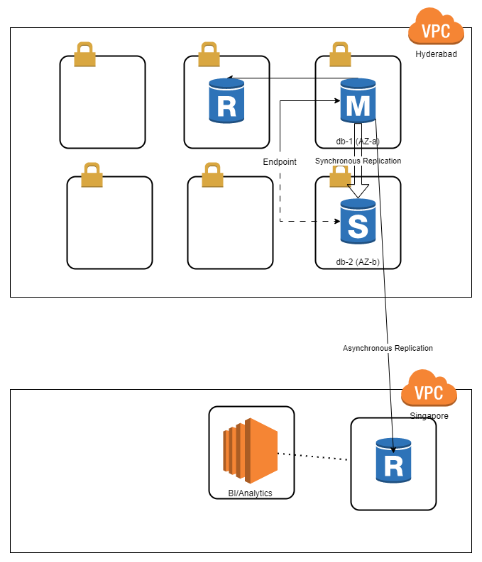

* _**Features of Aurora**_ :

    [ Refer Here : https://docs.aws.amazon.com/AmazonRDS/latest/AuroraUserGuide/Concepts.AuroraFeaturesRegionsDBEngines.grids.html ]

### RDS Proxy

* Supported for internal / private connections with in AWS from serverless to database
* RDS Proxy makes database HA ( Highly Available ) by reusing database connections

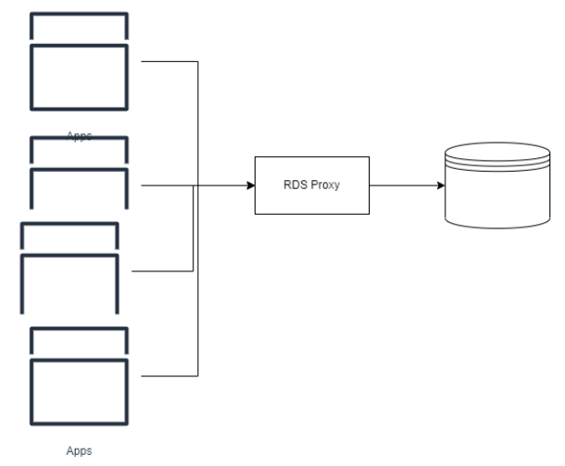

* Serverless Databases

    [ Refer Here : https://docs.aws.amazon.com/AmazonRDS/latest/AuroraUserGuide/Concepts.Aurora_Fea_Regions_DB-eng.Feature.ServerlessV2.html ]

* RDS DB Cluster

    [ Refer Here : https://docs.aws.amazon.com/AmazonRDS/latest/UserGuide/multi-az-db-clusters-concepts.html ]

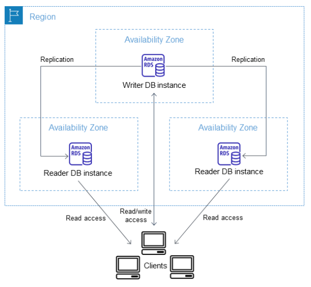

### AWS RDS Backups

* _**RDS backup**_ :
    * Takes full backup during maintenance window
    * Incremental backups are taken multiple times
    * _**POINT**_ in time restore enables transactional log backup

### NoSQL Databases on AWS

* Types :
    * Key-Value stores
    * Wide Column 
    * Document 
    * Graph 
* AWS gives managed options :
    * Dynamo DB ( Propietry database by AWS )
    * Document DB ( Mongo on AWS )
    * Key Spaces (  Cassandra on AWS )
    * Neptune ( Graph Database )

### Dynamo DB

* Create a table in Dynamo DB

=> Dynamo DB => Tables => Create table => Table name : qtdynamodb => Partition key : id 

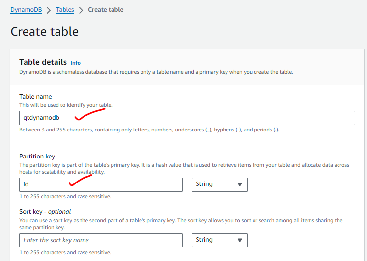

=> Table settings : Default settings 

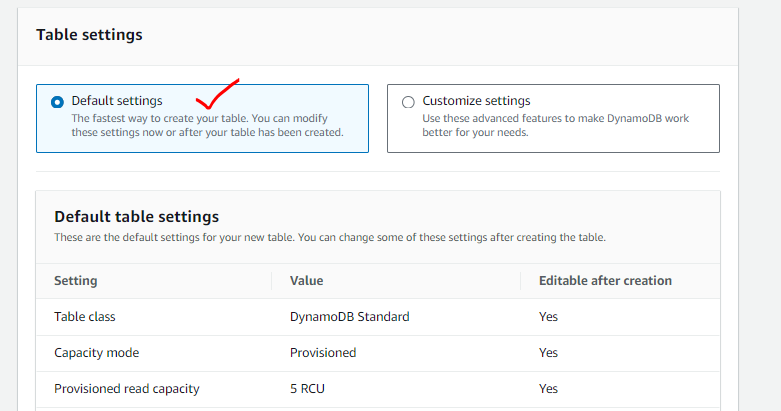

=> Create table

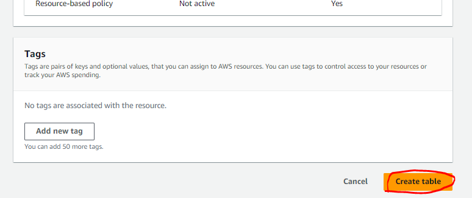
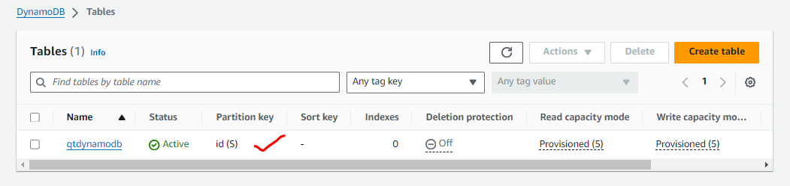

* Who will use these tables ?
    * _**Write code**_ : 
    
    [ Refer Here : https://docs.aws.amazon.com/code-library/latest/ug/python_3_dynamodb_code_examples.html ]

* _**Sample code**_ :
```
import boto3

def create_dynamo_client():
    dynamo_client  =  boto3.resource(service_name = 'dynamodb',region_name = 'us-east-1',
              aws_access_key_id = 'AKIA3BS5NFXXXXXXX',
              aws_secret_access_key = 'qfGTJL28HrqcbhKCM0t//xxx7gTGG4iNrv3/d94Lsp')
    return dynamo_client

def get_table(dynamo_client):
    sample_table = dynamo_client.Table('qtdynamodb')
    return sample_table

def create_ticket(table):
    table.put_item(Item = {
        'id': '1',
        'movie': 'avengers',
        'theatre': 'pvr',
        'username': 'qtdevops'
    })

def get_ticket(table):
    item = table.get_item(Key = {'id': '1'})

if __name__ == "__main__":
    dynamo_client = create_dynamo_client()
    table = get_table(dynamo_client)
    create_ticket()
    get_ticket()
```
### Dynamo DB Sizes

* For capacity modes :

    [ Refer here : https://docs.aws.amazon.com/amazondynamodb/latest/developerguide/ServiceQuotas.html#default-limits-throughput-capacity-modes ]

* Dynamo Db supports two capacity modes :
    * On-demand
    * Provisioned

#### Activity : Create a provisioned dynamodb

* Create a dynamo db table

=> Navigate through Dynamo DB => Tables => Create table => Table name : employees => Partition key : id => Create table

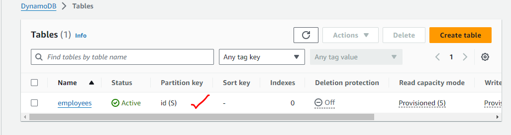

* Let's create global table by adding other region replicas

=> select table => click on Global tables => Create replica 

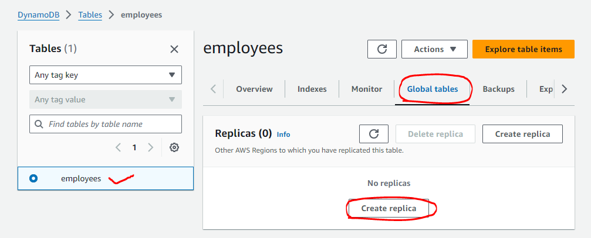

=> choose a region => Create replica

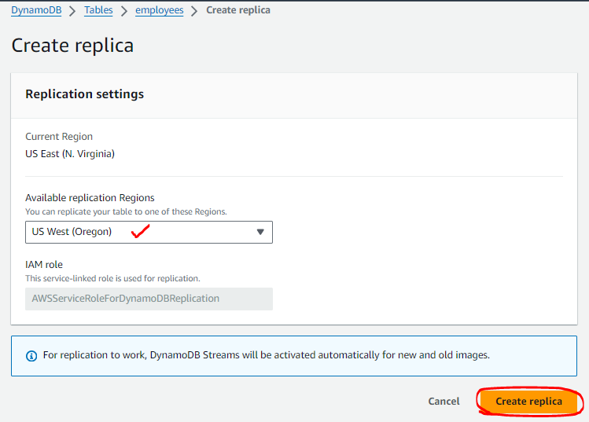

* The above table supports multi region write database
* Now add some items in one region and edit in other, sync should happen immediatly

=> Dynamo DB => Explore items => Create item 

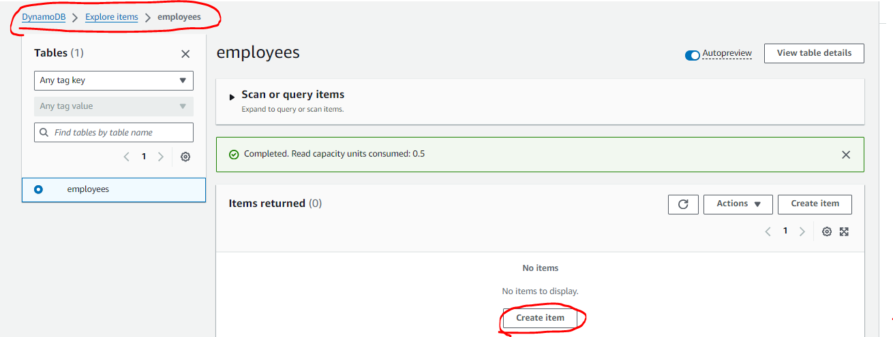

=> Form view => Attributes => partition key - value : 1001 => Add new attribute => String => name : qt => Create item

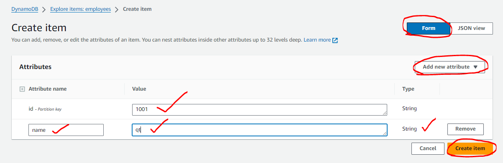
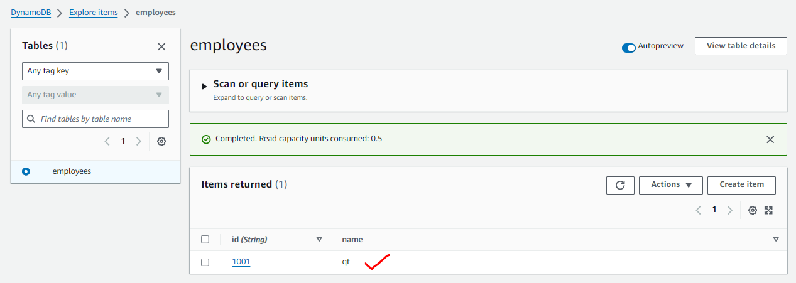

=> Go to the replica created region => select the item => Actions => Edit item

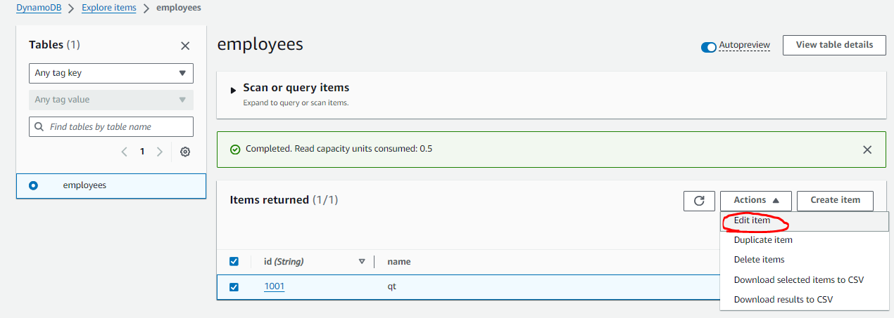

=> name : NewName => Save and close

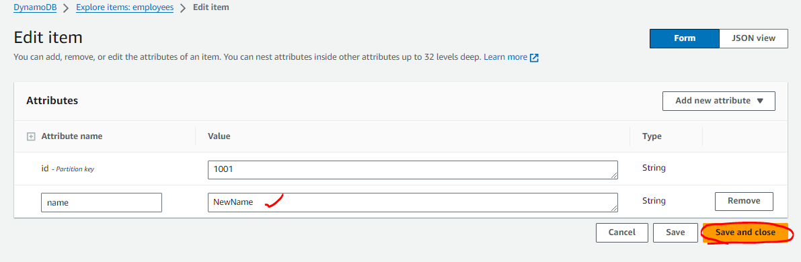
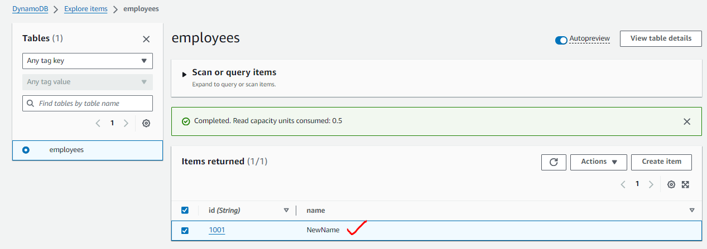

=> select the item => Actions => Edit item => Add new attribute => Number => mobile : 9876543210 => Save and close

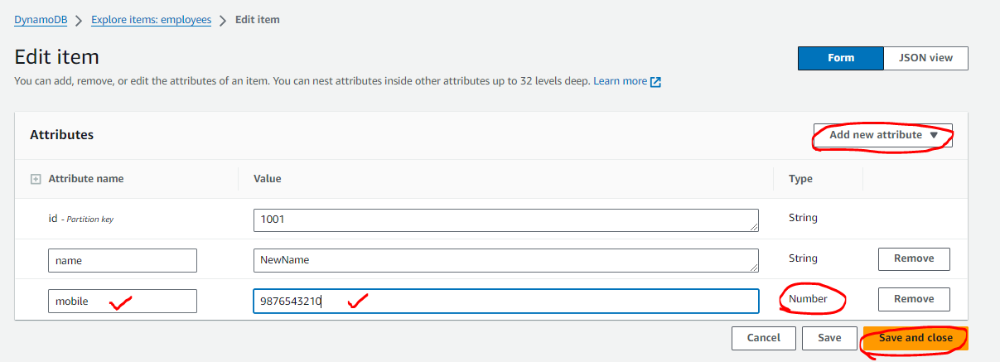
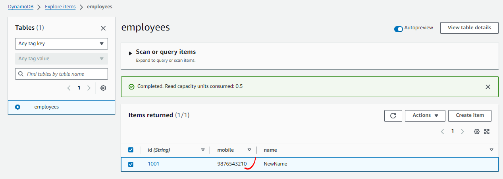

#### Activity : Enable PITR ( Point In Time Restore )

* Edit PITR

=> Dynamo DB => Tables => Edit PITR

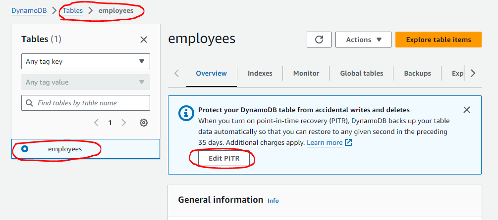

=> Turn on point-in-time recovery => Save changes

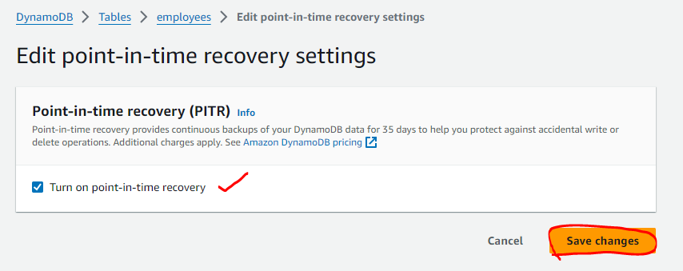

=> Status on

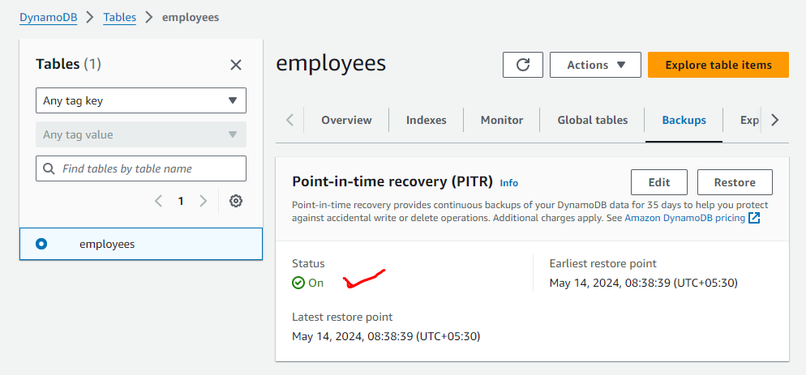

#### Activity : Backup Configuration

* Configure Backup

=> Dynamo DB=> Backups => Create backup => Ondemand backup => Backup settings => Default settings=> Create backup

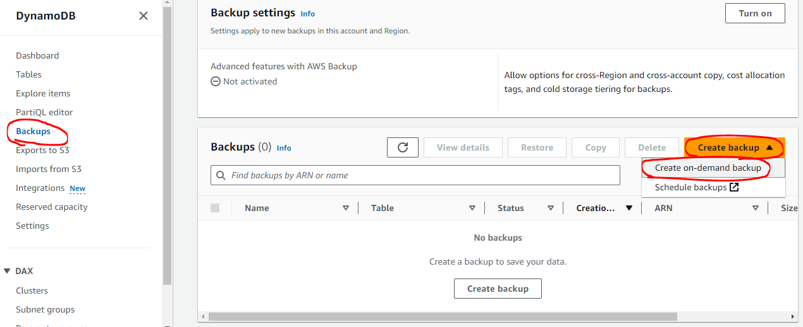
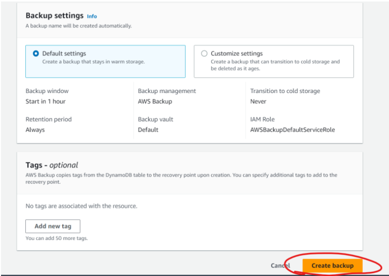

#### Activity : Export to S3

=> Dynamo DB => Export to s3 

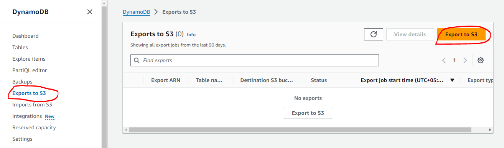

#### Dynamo DB Accelarator

* This is quick and very fast in-memory database

#### Reservations in Dynamo DB

* For documentation 

    [ Refer Here : https://docs.aws.amazon.com/whitepapers/latest/cost-optimization-reservation-models/amazon-dynamodb-reservations.html ]

#### Amazon Document DB ( Fully managed mongo db )

* Pricing 

    [ Refer Here : https://aws.amazon.com/documentdb/pricing/ ]

=> Amazon DocumentDB => Launch Amazon DocumentDB => Cluster type : Instance Based Cluster => Instance class => Number of instances => Authentication => Username : qtdevops => Password : qtdevops => Confirm password => Create cluster

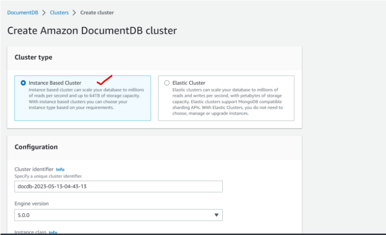
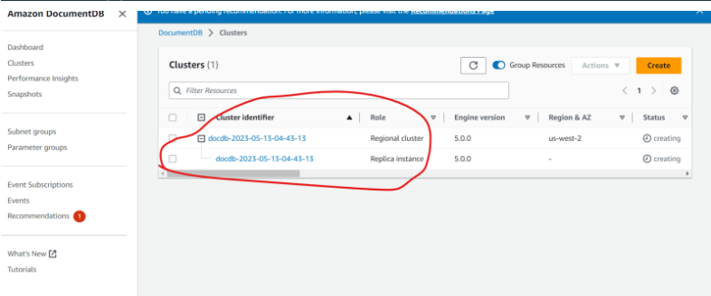
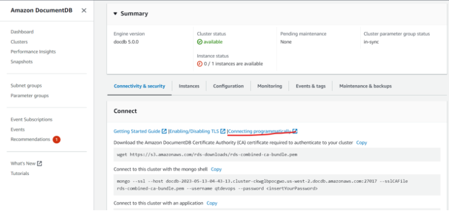

#### Exercise

* Try creating keyspaces 

    [ Refer Here : https://aws.amazon.com/keyspaces/pricing/ ]

### Cache Databases

* To store infrequently changed and frequently accesed data in RAM, _**Cache Database**_ have became popular. Some of the databases are :
    * Redis
    * Memcached
* Cache databases also started supporting `write` and `sync` to database
* AWS has launched `Elastic Cache` which supports both _**memcached**_ and _**redis**_ managed by AWS
* Recently they have launched `AWS Memory database` which is _**Redis**_ managed by AWS
* _**Other databases**_ :
    * Key Spaces ( Managed Cassandra )
    * Quantum DB ( Leger based configuration )
    * Time Series DB ( IOT based cconfiguration )
    * Neptune ( Graph databases )

### AWS CLI

* AWS has three interfaces to communicate :
    * _**Web interface**_ : AWS `Console console.aws.amazone.com`
    * _**Command Line interface**_ : AWS CLI
    * _**Code interface**_ : SDK ( boto3, java sdk, .net )
* CLI Interfaces help us in `automation`
* AWS Programmatic and console access :

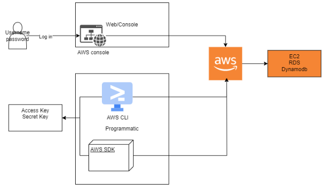

* Create an IAM user with Access Keys
* Installing AWS CLI 

    [ Refer Here : https://docs.aws.amazon.com/cli/latest/userguide/getting-started-install.html ]

* Configuring Access key and Secret access key at `aws configure`

#### Activity : Set up AWS CLI and configure IAM user

* Check if aws cli is working or not
```
aws s3 ls
```
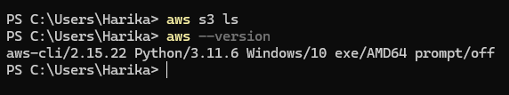

* Ensure visual studio code is installed

* Installing and setting up AWS CLI 

    [ Refer Here : https://www.youtube.com/watch?v=HSScHRcO0CA&list=PLuVH8Jaq3mLszrC7lv68a0VcrDripW-HK&index=5 ]

#### Activity : Get RDS db instances and other info

* For aws rds cli
    [ Refer here : https://docs.aws.amazon.com/cli/latest/reference/rds/ ]
* list or get => describe, list, get
* Get all db instances in the region 


* AWS CLI output formats :

    [ Refer Here : https://docs.aws.amazon.com/cli/latest/userguide/cli-usage-output-format.html ]


* Get all subnet groups


* Here we have a output in json format to understand it better


#### Exercise : ( aws ec2 cli )

* get all ec2 instances in the region
* get all security groups in the region
* get all key pairs in the region
* Remove all the un-necessary security groups, key pairs

#### Activity 1: Let's create a shell script to use aws cli to create rds mysql instance

* Steps :
    * We need a security group
        * mysql => 3306 ( port )
    * We need a db subnet group default or create one
    * We need to create a free-tier eligble db instance
        * instance class  : db.t2.micro
        * storage size : 20GB
* Creating security group
* Command Line
```
#!/bin/bash

aws ec2 create-security-group \
    --description "rds mysql security group" \
    --group-name "mysqlsg" \
    --vpc-id "vpc-0263a09e73d00080c"\
    --tag-specifications "ResourceType=security-group,Tags=[{Key=Name,Value=mysqlsg}]"

# {
#     "GroupId": "sg-08bcb448f727c9e96",
#     "Tags": [
#         {
#             "Key": "Name",
#             "Value": "mysqlsg"
#         }
#     ]
# }

### Add 3306 open rule to every one
aws ec2 authorize-security-group-ingress \
    --group-id sg-08bcb448f727c9e96 \
    --protocol tcp \
    --port 3306 \
    --cidr 0.0.0.0/0
# {
#     "Return": true,
#     "SecurityGroupRules": [
#         {
#             "SecurityGroupRuleId": "sgr-0c0e32b5788018104",
#             "GroupId": "sg-08bcb448f727c9e96",
#             "GroupOwnerId": "678879106782",
#             "IsEgress": false,
#             "IpProtocol": "tcp",
#             "FromPort": 3306,
#             "ToPort": 3306,
#             "CidrIpv4": "0.0.0.0/0"
#         }
#     ]
# }

# Create a mysql rds instance

aws rds create-db-instance \
   --db-name 'employees' \
   --db-instance-identifier 'qtemployeesdbinst' \
   --allocated-storage 20 \
   --db-instance-class "db.t2.micro" \
   --engine "mysql" \
   --master-username "root" \
   --master-user-password "rootroot" \
   --backup-retention-period 0 \
   --no-multi-az \
   --no-auto-minor-version-upgrade \
   --publicly-accessible \
   --vpc-security-group-ids "sg-08bcb448f727c9e96"

# {
#     "DBInstance": {
#         "DBInstanceIdentifier": "qtemployeesdbinst",
#         "DBInstanceClass": "db.t2.micro",
#         "Engine": "mysql",
#         "DBInstanceStatus": "creating",
#         "MasterUsername": "root",
#         "DBName": "employees",
#         "AllocatedStorage": 20,
#         "PreferredBackupWindow": "21:33-22:03",
#         "BackupRetentionPeriod": 0,
#         "DBSecurityGroups": [],
#         "VpcSecurityGroups": [
#             {
#                 "VpcSecurityGroupId": "sg-08bcb448f727c9e96",
#                 "Status": "active"
#             }
#         ],
#         "DBParameterGroups": [
#             {
#                 "DBParameterGroupName": "default.mysql8.0",
#                 "ParameterApplyStatus": "in-sync"
```


* Write a script to create a security group and then let's make it reusable
* We have made the script partially reusable :
```
#!/bin/bash

VPC_ID=$(aws ec2 describe-vpcs --filters "Name=is-default,Values=true" --query "Vpcs[0].VpcId" --output text)

echo "Found default vpc with id ${VPC_ID}"

SG_ID=$(aws ec2 create-security-group \
    --description "rds mysql security group" \
    --group-name "mysqlsg" \
    --vpc-id ${VPC_ID}\
    --tag-specifications "ResourceType=security-group,Tags=[{Key=Name,Value=mysqlsg}]" \
    --query "GroupId" \
    --output text)

echo "Created security group with id ${SG_ID}"


### Add 3306 open rule to every one
OUTPUT=$(aws ec2 authorize-security-group-ingress \
    --group-id ${SG_ID} \
    --protocol tcp \
    --port 3306 \
    --cidr 0.0.0.0/0)
```
#### Optimizing CLI script further

* Bash cheatsheet 

    [ Refer Here : https://devhints.io/bash ]

* For the changes done

    [ Refer here : https://github.com/asquarezone/awsadministration/commit/0fc75a49ba65a3caf02de13a083987a882606a5f#diff-68ce927f7692b5fead9a10f10bfada6761e6007d8392d8bef6ec28accfe9d753 ]

* We have added positional parameters
* We have created security group if it doesnot exist with the help of
    * bash
    * jmespath
* Try creating rds if it doesnot exists
* For the changes

    [ Refer here : https://github.com/asquarezone/awsadministration/commit/6719a38729ba810fbd460bd9416258a5e4c279ad ]

### Activities using CLI

#### Create a mysql free tier db with 2 days backe

* Add a read replica in different region
* For the shell script with named arguments

    [ Refer here : https://github.com/asquarezone/awsadministration/commit/5dde812b0deae8d450a12598bf549f1b2bc00c62 ]

* For docs

    [ Refer here : https://docs.aws.amazon.com/cli/latest/reference/rds/create-db-instance-read-replica.html ]

* For creating db instance read identifier use interpolation :
```
DBREADINSTANCE_IDENTIFIER="${DBINSTANCE_IDENTIFIER}-read"
```